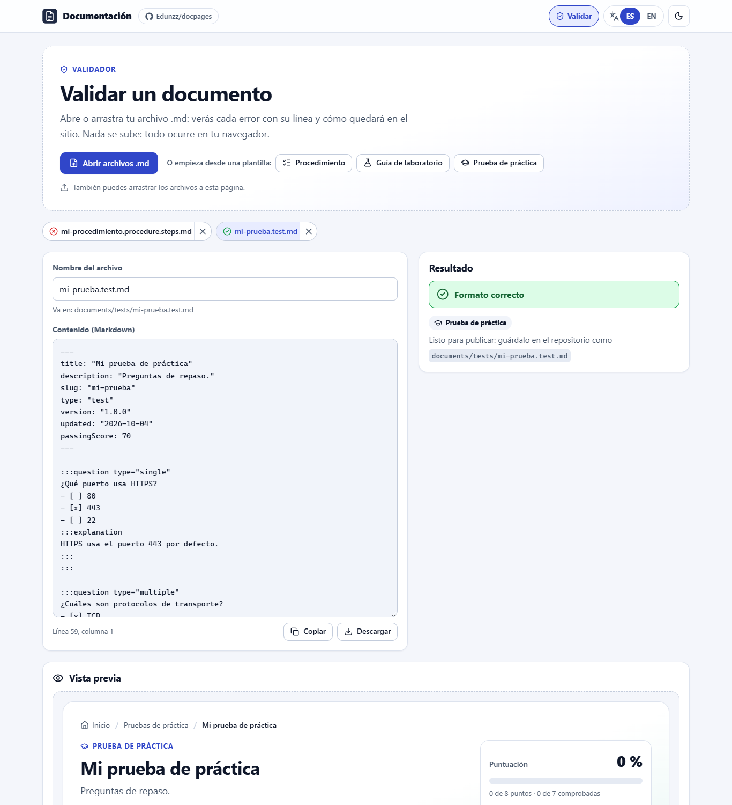

# DocPages

**Convierte archivos Markdown en un sitio bilingüe (español/inglés) en GitHub Pages: procedimientos paso a paso, guías de laboratorio y pruebas de práctica. Sin instalar ni compilar nada.**

[Read in English](README.md)

| Portada | Pestaña Validar |
|---|---|
|  |  |
| **Guía de laboratorio** | **Prueba de práctica** |
|  |  |

## ¿Qué puedo publicar?

| Tipo | Qué ve el lector | El nombre del archivo termina en |
|---|---|---|
| **Procedimiento** | Pasos con casillas y una barra de progreso. | `.procedure.steps.md` |
| **Guía de laboratorio** | Un procedimiento con objetivos, requisitos, duración y nivel. | `.labguide.steps.md` |
| **Prueba de práctica** | Preguntas de entrenamiento que responde, comprueba y puntúa. | `.test.md` |

**El final del nombre del archivo decide el tipo.** Los procedimientos y las guías van en `documents/steps/`; las pruebas, en `documents/tests/`.

Todo funciona en el navegador: sin servidor, sin base de datos y sin compilar. El progreso y las respuestas se guardan solo en el navegador de cada lector.

## Empieza en 3 pasos

1. Pulsa **Use this template** (o haz un *fork*) para tener tu propia copia.
2. En tu copia, abre **Settings → Pages** y elige **Deploy from a branch**, rama **`main`**, carpeta **`/ (root)`**. Guarda.
3. Añade o edita archivos en `documents/` y súbelos a `main`. En uno o dos minutos tu sitio está en `https://<tu-usuario>.github.io/<tu-repositorio>/`.

No tienes que cambiar nombres ni enlaces: el sitio detecta solo tu usuario, tu repositorio y tus documentos. Los archivos que ya hay en `documents/` son ejemplos; puedes conservarlos, editarlos o borrarlos.

## Escribir un procedimiento

Crea `documents/steps/instalar-la-app.procedure.steps.md`:

```markdown
---
title: "Instalar la aplicación"
description: "Desde la descarga hasta el primer inicio."
slug: "instalar-la-app"
type: "steps"
version: "1.0.0"
updated: "2026-10-04"
---

:::step id="descargar" title="Descargar"
- [ ] Descarga el instalador.
- [ ] Comprueba el tamaño del archivo.
:::

:::step id="instalar" title="Instalar"
- [ ] Ejecuta el instalador.
:::
```

- Todo lo que hay entre `:::step` y `:::` es un paso. Dentro de un paso puedes poner bloques `:::substep`.
- Cada línea `- [ ]` es una casilla que cuenta para la barra de progreso.
- El `id` no se repite dentro del archivo. El `slug` es la dirección de la página y no se repite entre archivos.

## Escribir una guía de laboratorio

Mismo formato, pero el nombre termina en `.labguide.steps.md` y puedes añadir objetivos, requisitos, duración y nivel (aparecen arriba de la página). Crea `documents/steps/primer-contenedor.labguide.steps.md`:

```markdown
---
title: "Laboratorio: tu primer contenedor"
description: "Ejecuta un contenedor y detenlo."
slug: "lab-primer-contenedor"
type: "steps"
version: "1.0.0"
updated: "2026-10-04"
duration: "30 minutos"
level: "beginner"
objectives:
  - "Ejecutar un contenedor."
  - "Detenerlo."
prerequisites:
  - "Docker instalado."
---

:::step id="ejecutar" title="Ejecutar el contenedor"
- [ ] `docker run hello-world` muestra un saludo.
:::
```

`level` puede ser `beginner` (básico), `intermediate` (intermedio) o `advanced` (avanzado). Ejemplo completo, que enseña los siete tipos de pregunta: [`first-practice-test-lab.labguide.steps.md`](documents/steps/first-practice-test-lab.labguide.steps.md).

## Escribir una prueba de práctica

Crea `documents/tests/redes-basicas.test.md`. Cada pregunta es un bloque `:::question`:

```markdown
---
title: "Redes básicas"
description: "Preguntas rápidas de repaso."
slug: "redes-basicas"
type: "test"
version: "1.0.0"
updated: "2026-10-04"
passingScore: 70
---

:::question type="single"
¿Qué puerto usa HTTPS?
- [ ] 80
- [x] 443
- [ ] 22
:::explanation
HTTPS usa el puerto 443 por defecto.
:::
:::

:::question type="true-false" answer="false"
UDP garantiza que los paquetes lleguen.
:::
```

Marca la opción correcta con `[x]`. `:::explanation` (opcional) aparece cuando el lector comprueba su respuesta. `:::hint` (opcional) es una pista que el lector puede abrir.

### Tipos de pregunta

| `type` | Para qué sirve | Cómo indicas la respuesta |
|---|---|---|
| `single` | Elegir una opción | Opciones `- [ ]`; marca exactamente una con `- [x]` |
| `multiple` | Elegir todas las correctas | Marca cada opción correcta con `- [x]` |
| `true-false` | Verdadero o falso | `answer="true"` o `answer="false"` |
| `text` | Respuesta corta | `answer="DNS\|Domain Name System"` (alternativas separadas por `\|`; no importan mayúsculas ni tildes) |
| `number` | Respuesta numérica | `answer="255"` y, si quieres, `tolerance="0.5"` |
| `order` | Ordenar elementos | Una lista numerada en el orden correcto (el sitio la desordena) |
| `match` | Relacionar parejas | Una lista de líneas `elemento :: pareja` |

```markdown
:::question type="match"
Relaciona cada protocolo con su puerto:

- HTTP :: 80
- HTTPS :: 443
- SSH :: 22
:::
```

Más opciones: `points="2"` en una pregunta (por defecto vale 1). En el front matter, `feedback: "end"` corrige todo cuando el lector termina y `shuffle: true` baraja las opciones. Ejemplo completo con los siete tipos: [`docpages-basics.test.md`](documents/tests/docpages-basics.test.md).

> [!NOTE]
> Las respuestas están en tu Markdown, que es público. Las pruebas de práctica sirven para entrenar, no para exámenes oficiales.

## Dos idiomas (opcional)

Lo que escribes una vez se ve en los dos idiomas. Para traducir, usa `{ es: "…", en: "…" }` en el front matter, `title.es="…" title.en="…"` en los pasos y bloques `:::lang` en el cuerpo:

```markdown
:::lang es
¡Hola! Este párrafo se muestra en español.
:::
:::lang en
Hello! This paragraph is shown in English.
:::
```

El lector cambia de idioma con los botones ES/EN de la parte de arriba del sitio.

## Revisa tu documento: la pestaña Validar

Abre **Validar** (arriba a la derecha del sitio, publicado o en tu equipo):

1. **Abre** o arrastra tus archivos `.md`, o empieza desde una **plantilla** (procedimiento, guía de laboratorio o prueba de práctica con los siete tipos de pregunta).
2. Cada error indica **su línea**; al pulsarlo, el cursor salta allí. Puedes corregirlo ahí mismo, en el editor.
3. Cuando no hay errores ves la **vista previa real**: puedes marcar pasos o responder las preguntas.
4. **Descarga** el archivo (o cópialo), guárdalo en la carpeta que te indica y súbelo a `main`.

No se sube nada a ningún sitio: todo ocurre en tu navegador. El validador también te avisa si otro documento ya usa tu `slug`.

El sitio nunca publica un archivo que no siga el formato: si alguno se cuela en `documents/`, la portada lo muestra en **Documentos con errores de formato**, con la línea de cada error.

| Si el mensaje dice… | Qué hacer |
|---|---|
| «El archivo no sigue el formato» / «Indica el tipo en el nombre» | Renómbralo para que termine en `.procedure.steps.md`, `.labguide.steps.md` o `.test.md`. |
| «Atributo desconocido» o «Atributo mal escrito» | Corrige la errata en la línea `:::` y usa comillas: `title="…"`. |
| «exactamente una opción correcta» | Marca una sola `- [x]` (usa `type="multiple"` si hay varias). |
| «fuera de un «:::question»» | Mueve las opciones dentro de un bloque de pregunta. |
| «slug duplicado» / «ya lo usa» | Dos archivos usan el mismo `slug`; cambia uno. |

## Verlo en tu equipo (opcional)

Sirve la carpeta del repositorio con cualquier servidor web que muestre el contenido de las carpetas. En VS Code, clic derecho sobre `index.html` → **Open with Live Server**; o, en una terminal dentro de la carpeta:

```bash
python -m http.server 8000
```

Abre <http://localhost:8000/>. La portada muestra lo que hay en **tu** carpeta `documents/`, con los errores marcados, y los enlaces al repositorio apuntan a tu copia. Abrir `index.html` con doble clic no funciona: los navegadores bloquean la aplicación cuando se abre como archivo.

## Configuración

- **Mostrar solo algunos tipos:** en `assets/js/config.js`, pon `DOCUMENTATION_MODE` en `"all"` (todo), `"steps"` (procedimientos y guías de laboratorio) o `"tests"` (pruebas de práctica).
- **Nombre del sitio:** `siteTitle` y `siteTagline` en el mismo archivo.
- **Dominio propio:** pon `repository: { owner: "tu-usuario", name: "tu-repositorio" }` en el mismo archivo, para que el sitio sepa qué repositorio leer.
- **Colores y logo:** las variables del inicio de `assets/css/app.css` y el archivo `assets/icons/logo.svg`.

## Problemas comunes

| Problema | Solución |
|---|---|
| Un documento nuevo no aparece | Espera uno o dos minutos a que Pages publique y pulsa **Actualizar** en la portada. Revisa el nombre en **Validar**. |
| «Límite de consultas» en la portada | El sitio lee la lista de documentos de GitHub (como mucho una vez cada 10 minutos por navegador) y GitHub permite 60 lecturas por hora por red. Espera un poco; mientras tanto se usa la última lista guardada. |
| Se borró mi progreso o mis respuestas | Cambiaste `version`, `slug` o algún `id`. Cada versión guarda su propio progreso, a propósito. |
| El sitio muestra el Markdown como páginas sueltas | Falta el archivo `.nojekyll` en la raíz; vuelve a añadirlo (es un archivo vacío). |

## Con un asistente de IA

El skill [`.github/skills/documentation-pages/SKILL.md`](.github/skills/documentation-pages/SKILL.md) le enseña todas las reglas a los agentes de IA (GitHub Copilot, Claude…). Por ejemplo, pega tus preguntas con sus respuestas y pide: *«Conviértelas en una prueba de práctica»*. El agente escribe un `.test.md` válido; tú lo revisas en **Validar** y lo subes.

## Para desarrolladores

<details>
<summary>Cómo funciona, pruebas, estructura y seguridad</summary>

### Cómo funciona

- **Sin compilación.** GitHub Pages sirve el repositorio tal cual. Las librerías del navegador están versionadas en `assets/vendor/` (sin CDN).
- **Lista de documentos.** En GitHub Pages, una consulta a la API pública de GitHub (`git/trees/HEAD`) lista `documents/` y se guarda 10 minutos en cada navegador; si falla, se usa la última lista guardada. En local, el sitio lee el listado de carpetas del servidor web.
- **Repositorio.** Sale de la URL de GitHub Pages; en local, de `.git/config` (`origin`) si el servidor lo sirve; `CONFIG.repository` tiene prioridad sobre ambos.
- **Mismas reglas en todas partes.** La portada, la pestaña Validar y el validador por consola usan los mismos módulos (`assets/js/documents.js`, `quiz.js`, `markdown.js`, `schema.js`).
- Rutas con `#` (`#/steps/{slug}`, `#/tests/{slug}`, `#/validate`), así el sitio funciona en la raíz del dominio y bajo `/{repositorio}/`.

### Línea de comandos (opcional)

```bash
node scripts/validate-documents.mjs        # solo necesita Node: --json para agentes, --strict para fallar también con avisos
npm ci && npm test                         # pruebas unitarias, de integración (jsdom) y de accesibilidad (axe-core)
npm run check:links                        # enlaces internos, imports e iconos
npm run vendor                             # actualiza assets/vendor y el sprite tras cambiar librerías
```

En GitHub Actions, `validate-documents.mjs` además escribe anotaciones `::error file=…,line=…::`, por si quieres añadir tu propia revisión.

### Estructura

```text
assets/js/        app, router, catálogo (descubre documentos), validador (pestaña Validar), pasos, pruebas, parser, validación
assets/css/       estilos (tema claro y oscuro, responsive)
assets/vendor/    markdown-it, js-yaml, DOMPurify, Prism
documents/        tus documentos (steps/ y tests/)
schemas/          JSON Schema del front matter
scripts/          validate-documents, check-links, vendor
tests/            node:test + jsdom + axe-core
docs/             diagrama del flujo del progreso y capturas
```

### Seguridad

El HTML crudo nunca se ejecuta: markdown-it trabaja con `html: false` y todo el HTML generado pasa por DOMPurify. Solo se permiten enlaces `http(s)`, `mailto`, `tel`, anclas y rutas relativas (`javascript:` y `data:` son errores de validación). Una política de seguridad de contenido (CSP) estricta bloquea scripts y estilos en línea. No hay tokens en el frontend. La pestaña Validar nunca sube archivos.

### Accesibilidad

HTML semántico, navegación con teclado, foco visible, avisos para lectores de pantalla, estados con icono y texto (no solo color), respeto por `prefers-reduced-motion` y un diseño que funciona desde móviles de 360 px hasta pantallas anchas. Las pruebas ejecutan axe-core en todas las vistas y en ambos idiomas.

</details>

## Créditos

Desarrollado por **Jose Eduardo Romero Jimenez** · [github.com/Edunzz](https://github.com/Edunzz).

Licencia: [MIT](LICENSE) · Cómo contribuir: [CONTRIBUTING.md](CONTRIBUTING.md) · Librerías de terceros: [avisos](assets/vendor/THIRD_PARTY_NOTICES.md).
