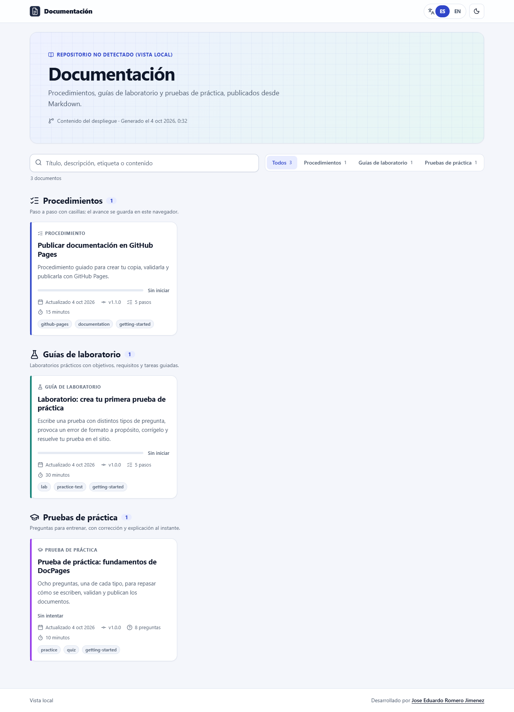
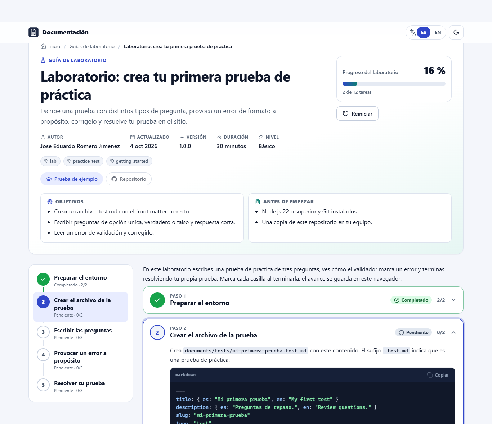
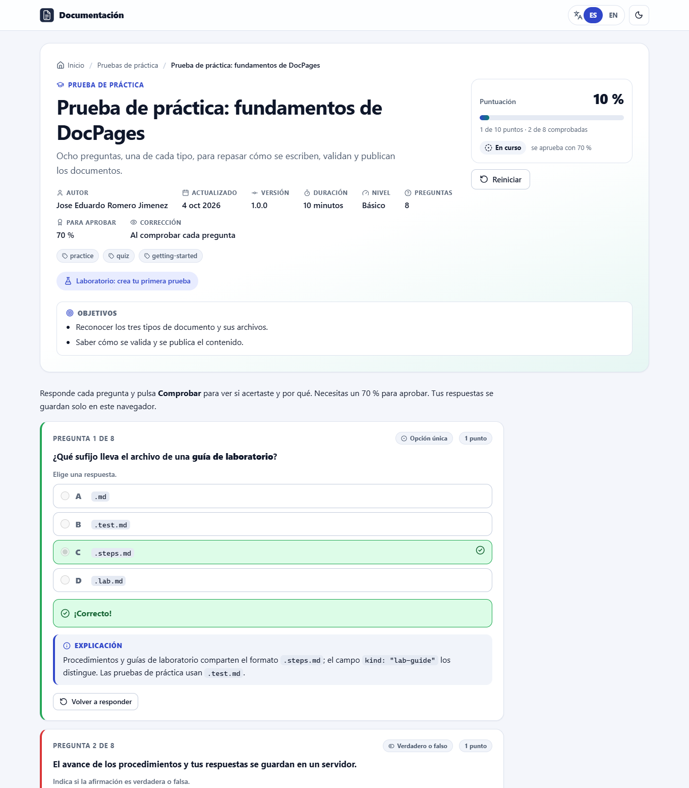

# DocPages

**Convierte archivos Markdown en un sitio bilingüe (español/inglés) en GitHub Pages: procedimientos paso a paso, guías de laboratorio y pruebas de práctica.**

[Read in English](README.md)

| Portada | Guía de laboratorio | Prueba de práctica |
|---|---|---|
|  |  |  |

## ¿Qué puedo publicar?

| Tipo | Qué ve el lector | Archivo que escribes |
|---|---|---|
| **Procedimiento** | Pasos con casillas y una barra de progreso. | `documents/steps/mi-procedimiento.steps.md` |
| **Guía de laboratorio** | Un procedimiento con objetivos, requisitos, duración y nivel. | `documents/steps/mi-laboratorio.steps.md` con `kind: "lab-guide"` |
| **Prueba de práctica** | Preguntas de entrenamiento que responde, comprueba y puntúa. | `documents/tests/mi-prueba.test.md` |

Todo funciona en el navegador: sin servidor y sin base de datos. El progreso y las respuestas se guardan solo en el navegador de cada lector.

## Empieza en 4 pasos

1. Pulsa **Use this template** (o haz un *fork*) para tener tu propia copia.
2. En tu copia, abre **Settings → Pages** y en **Source** elige **GitHub Actions**.
3. Añade o edita archivos en `documents/` (mira abajo) y haz *push* a `main`.
4. Espera el check verde en la pestaña **Actions**. Tu sitio queda en `https://<tu-usuario>.github.io/<tu-repositorio>/`.

No tienes que cambiar nombres ni enlaces: el sitio detecta solo tu usuario y tu repositorio. Los archivos que ya hay en `documents/` son ejemplos; puedes conservarlos, editarlos o borrarlos.

## Escribir un procedimiento

Crea `documents/steps/instalar-la-app.steps.md`:

```markdown
---
title: "Instalar la aplicación"
description: "Desde la descarga hasta el primer inicio."
slug: "instalar-la-app"
type: "steps"
kind: "procedure"
version: "1.0.0"
updated: "2026-10-04"
---

:::step id="descargar" title="Descargar"
- [ ] Descarga el instalador.
- [ ] Comprueba el tamaño del archivo.
:::

:::step id="instalar" title="Instalar"
- [ ] Ejecuta el instalador.
:::
```

- Todo lo que hay entre `:::step` y `:::` es un paso. Dentro de un paso puedes poner bloques `:::substep`.
- Cada línea `- [ ]` es una casilla que cuenta para la barra de progreso.
- El `id` no se repite dentro del archivo. El `slug` es la dirección de la página y no se repite entre archivos.

## Escribir una guía de laboratorio

Es un procedimiento con `kind: "lab-guide"` y unos campos extra que aparecen arriba de la página:

```markdown
---
title: "Laboratorio: tu primer contenedor"
description: "Ejecuta un contenedor y detenlo."
slug: "lab-primer-contenedor"
type: "steps"
kind: "lab-guide"
version: "1.0.0"
updated: "2026-10-04"
duration: "30 minutos"
level: "beginner"
objectives:
  - "Ejecutar un contenedor."
  - "Detenerlo."
prerequisites:
  - "Docker instalado."
---

:::step id="ejecutar" title="Ejecutar el contenedor"
- [ ] `docker run hello-world` muestra un saludo.
:::
```

`level` puede ser `beginner` (básico), `intermediate` (intermedio) o `advanced` (avanzado). Ejemplo completo: [`first-practice-test-lab.steps.md`](documents/steps/first-practice-test-lab.steps.md).

## Escribir una prueba de práctica

Crea `documents/tests/redes-basicas.test.md`. Cada pregunta es un bloque `:::question`:

```markdown
---
title: "Redes básicas"
description: "Preguntas rápidas de repaso."
slug: "redes-basicas"
type: "test"
version: "1.0.0"
updated: "2026-10-04"
passingScore: 70
---

:::question type="single"
¿Qué puerto usa HTTPS?
- [ ] 80
- [x] 443
- [ ] 22
:::explanation
HTTPS usa el puerto 443 por defecto.
:::
:::

:::question type="true-false" answer="false"
UDP garantiza que los paquetes lleguen.
:::
```

Marca la opción correcta con `[x]`. `:::explanation` (opcional) aparece cuando el lector comprueba su respuesta. `:::hint` (opcional) es una pista que el lector puede abrir.

### Tipos de pregunta

| `type` | Para qué sirve | Cómo indicas la respuesta |
|---|---|---|
| `single` | Elegir una opción | Opciones `- [ ]`; marca exactamente una con `- [x]` |
| `multiple` | Elegir todas las correctas | Marca cada opción correcta con `- [x]` |
| `true-false` | Verdadero o falso | `answer="true"` o `answer="false"` |
| `text` | Respuesta corta | `answer="DNS\|Domain Name System"` (alternativas separadas por `\|`; no importan mayúsculas ni tildes) |
| `number` | Respuesta numérica | `answer="255"` y, si quieres, `tolerance="0.5"` |
| `order` | Ordenar elementos | Una lista numerada en el orden correcto (el sitio la desordena) |
| `match` | Relacionar parejas | Una lista de líneas `elemento :: pareja` |

```markdown
:::question type="match"
Relaciona cada protocolo con su puerto:

- HTTP :: 80
- HTTPS :: 443
- SSH :: 22
:::
```

Más opciones: `points="2"` en una pregunta (por defecto vale 1). En el front matter, `feedback: "end"` corrige todo cuando el lector termina y `shuffle: true` baraja las opciones. Ejemplo completo con los siete tipos: [`docpages-basics.test.md`](documents/tests/docpages-basics.test.md).

> [!NOTE]
> Las respuestas están en tu Markdown, que es público. Las pruebas de práctica sirven para entrenar, no para exámenes oficiales.

## Dos idiomas (opcional)

Lo que escribes una vez se ve en los dos idiomas. Para traducir, usa `{ es: "…", en: "…" }` en el front matter, `title.es="…" title.en="…"` en los pasos y bloques `:::lang` en el cuerpo:

```markdown
:::lang es
¡Hola! Este párrafo se muestra en español.
:::
:::lang en
Hello! This paragraph is shown in English.
:::
```

El lector cambia de idioma con los botones ES/EN de la parte de arriba del sitio.

## Si un archivo está mal, te enteras

El sitio nunca publica un archivo que no siga el formato. Revisa tus archivos con:

```bash
npm run validate
```

Cada problema indica el archivo, la línea y el motivo:

```text
✖ documents/tests/redes-basicas.test.md
    error   L11: Pregunta 1: una pregunta «single» necesita exactamente una opción correcta «- [x]» (tiene 0).
```

En GitHub se hace la misma revisión en cada *push* y en cada *pull request*. Si falla, GitHub marca la línea del archivo y el sitio publicado no cambia.

| Si el mensaje dice… | Qué hacer |
|---|---|
| «El archivo no sigue el formato» | Renombra el archivo para que termine en `.steps.md` o `.test.md`, o sácalo de `documents/`. |
| «Atributo desconocido» o «Atributo mal escrito» | Corrige la errata en la línea `:::` y usa comillas: `title="…"`. |
| «exactamente una opción correcta» | Marca una sola `- [x]` (usa `type="multiple"` si hay varias). |
| «fuera de un «:::question»» | Mueve las opciones dentro de un bloque de pregunta. |
| «slug duplicado» | Dos archivos usan el mismo `slug`; cambia uno. |

## Probarlo en tu equipo (opcional)

Necesitas [Node.js](https://nodejs.org/) 22 o superior.

```bash
npm ci            # instalar (una vez)
npm run validate  # revisar tus documentos
npm run preview   # abre http://localhost:8080/docpages/
```

## Configuración

- **Mostrar solo algunos tipos:** en `assets/js/config.js`, pon `DOCUMENTATION_MODE` en `"all"` (todo), `"steps"` (procedimientos y guías de laboratorio) o `"tests"` (pruebas de práctica).
- **Nombre del sitio:** `siteTitle` y `siteTagline` en el mismo archivo.
- **Colores y logo:** las variables del inicio de `assets/css/app.css` y el archivo `assets/icons/logo.svg`.

## Problemas comunes

| Problema | Solución |
|---|---|
| El workflow falla en «Configurar GitHub Pages» | Settings → Pages → Source: **GitHub Actions** y vuelve a ejecutar el workflow. |
| Mi documento nuevo no aparece | Ejecuta `npm run validate`; revisa el nombre del archivo y la carpeta. |
| Se borró mi progreso o mis respuestas | Cambiaste `version`, `slug` o algún `id`. Cada versión guarda su propio progreso, a propósito. |
| «Límite de solicitudes» al actualizar desde GitHub | GitHub permite 60 solicitudes por hora sin iniciar sesión. Espera y vuelve a intentarlo. |
| Abrir `index.html` directamente da error | Usa `npm run preview`: los documentos no se pueden cargar desde `file://`. |

## Con un asistente de IA

El skill [`.github/skills/documentation-pages/SKILL.md`](.github/skills/documentation-pages/SKILL.md) le enseña todas las reglas a los agentes de IA (GitHub Copilot, Claude…). Por ejemplo, pega tus preguntas con sus respuestas y pide: *«Conviértelas en una prueba de práctica»*. El agente escribe un `.test.md` válido y ejecuta `npm run validate`.

## Para desarrolladores

<details>
<summary>Comandos, cómo se publica, estructura y seguridad</summary>

### Comandos

| Comando | Qué hace |
|---|---|
| `npm run vendor` | Copia las librerías del navegador a `assets/vendor/` y genera el sprite de iconos. |
| `npm run validate` | Valida cada Markdown de `documents/`. `--json` para agentes y `--strict` para fallar también con avisos. |
| `npm run manifest` | Escribe `documents.manifest.json` (el índice del sitio). No escribe nada si hay errores. |
| `npm run check:links` | Revisa enlaces internos, imágenes, imports e iconos. |
| `npm test` | Pruebas unitarias, de integración (jsdom) y de accesibilidad (axe-core). |
| `npm run build` | Todo lo anterior salvo las pruebas, más el sitio estático en `_site/`. |
| `npm run preview` | Construye y sirve `_site/` bajo `/docpages/`, como un sitio de proyecto de GitHub Pages. |

En Git Bash para Windows, antepón `MSYS_NO_PATHCONV=1` al ejecutar `node scripts/serve.mjs --base /mi-repo/`.

### Publicación

- [`.github/workflows/pages.yml`](.github/workflows/pages.yml) se ejecuta en cada *push* a `main`: instala, valida, genera el manifiesto con los datos de tu repositorio, revisa enlaces, prueba, construye `_site/` y despliega. Permisos mínimos (`contents: read`, `pages: write`, `id-token: write`), acciones fijadas por SHA y sin despliegues superpuestos.
- [`.github/workflows/validate.yml`](.github/workflows/validate.yml) se ejecuta en los *pull requests* con permisos de solo lectura, así los errores se marcan antes de unir los cambios.
- Sin Actions: ejecuta `npm run vendor && npm run manifest`, versiona el resultado, elige **Settings → Pages → Deploy from a branch → `main` / root** y conserva el archivo `.nojekyll`.

### Cómo funciona

- Rutas con `#` (`#/steps/{slug}`, `#/tests/{slug}`), así el sitio funciona en la raíz del dominio y bajo `/{repositorio}/`.
- El repositorio se detecta desde la URL de GitHub Pages y, si no, desde el manifiesto del despliegue; `CONFIG.repository` en `config.js` tiene prioridad (útil con un dominio propio).
- **Actualizar desde el repositorio público** lee los documentos en vivo con la API pública de GitHub, los valida con las mismas reglas que el CI y muestra los archivos inválidos con sus errores. Si GitHub no responde, se conserva el contenido desplegado.
- Los scripts de Node importan los mismos módulos que el navegador: la validación local, la del CI y la del sitio siempre coinciden.

### Estructura

```text
assets/js/        app, router, parser de Markdown, validación, steps.js (procedimientos y guías), quiz.js (pruebas)
assets/css/       estilos (tema claro y oscuro)
assets/vendor/    markdown-it, js-yaml, DOMPurify, Prism (sin CDN)
documents/        tus documentos (steps/ y tests/)
schemas/          JSON Schema del front matter
scripts/          validate, manifest, check-links, build-site, serve, vendor
tests/            node:test + jsdom + axe-core
docs/             diagrama del flujo del progreso y capturas
```

### Seguridad

El HTML crudo nunca se ejecuta: markdown-it trabaja con `html: false` y todo el HTML generado pasa por DOMPurify. Solo se permiten enlaces `http(s)`, `mailto`, `tel`, anclas y rutas relativas (`javascript:` y `data:` son errores de validación). Una política de seguridad de contenido (CSP) estricta bloquea scripts y estilos en línea. No hay tokens en el frontend; la API pública se usa sin autenticación (60 solicitudes por hora y por IP).

### Accesibilidad

HTML semántico, navegación con teclado, foco visible, avisos para lectores de pantalla, estados con icono y texto (no solo color) y respeto por `prefers-reduced-motion`. Las pruebas ejecutan axe-core en todas las vistas y en ambos idiomas.

</details>

## Créditos

Desarrollado por **Jose Eduardo Romero Jimenez** · [github.com/Edunzz](https://github.com/Edunzz).

Licencia: [MIT](LICENSE) · Cómo contribuir: [CONTRIBUTING.md](CONTRIBUTING.md) · Librerías de terceros: [avisos](assets/vendor/THIRD_PARTY_NOTICES.md).
