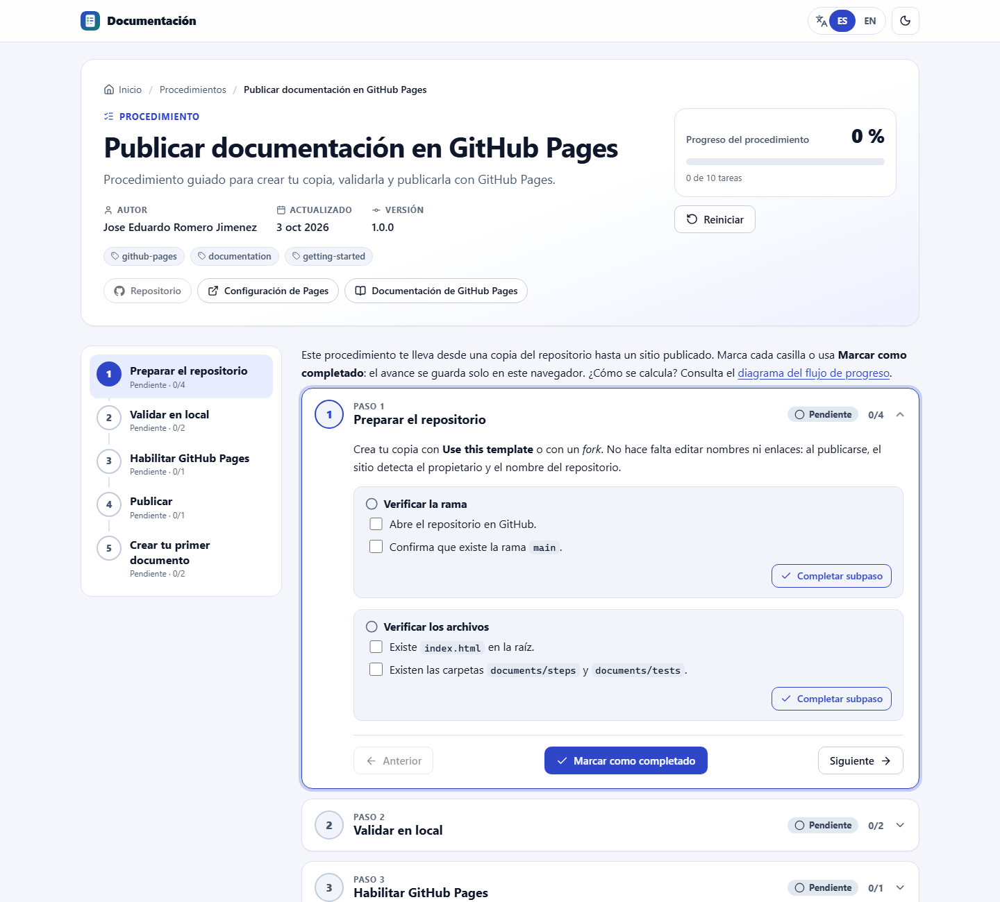
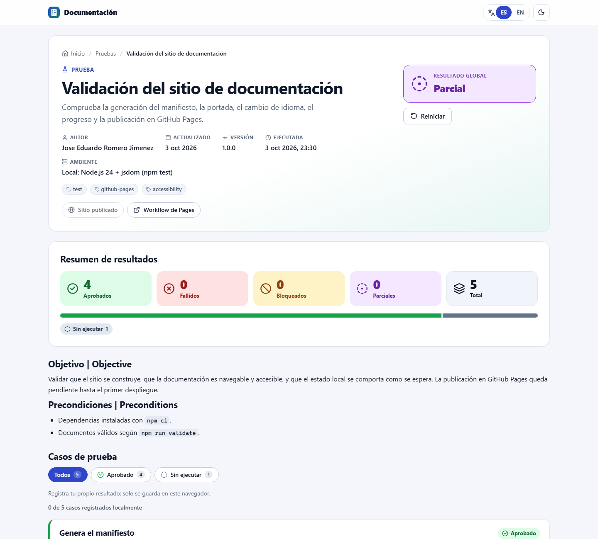

# DocPages · Documentación bilingüe en GitHub Pages

Sitio estático que publica en **GitHub Pages** los Markdown de `/documents` como documentación interactiva en **español e inglés**:

- **Procedimientos** (`{titulo}.steps.md`): pasos, subpasos y casillas, con navegación, porcentaje de avance y progreso guardado en el navegador.
- **Pruebas** (`{titulo}.test.md`): ejecución de una prueba con veredicto, resumen por estado, casos, evidencia y una re-ejecución local opcional.

Todo corre en el navegador (HTML, CSS y JavaScript). No hay backend, base de datos ni CDN, y una copia del repositorio muestra **su propio** propietario y nombre sin editar nada.

| Portada | Procedimiento | Prueba |
|---|---|---|
|  |  |  |

Modo oscuro: [portada](docs/images/home-dark.png) · [procedimiento](docs/images/steps-dark.png). Las capturas se tomaron con Chrome sobre el sitio construido (`npm run preview`), en vista local, por eso aparece «Repositorio no detectado».

---

## Contenido

1. [Demo publicada](#1-demo-publicada)
2. [Requisitos](#2-requisitos)
3. [Inicio rápido](#3-inicio-rápido)
4. [Habilitar GitHub Pages](#4-habilitar-github-pages)
5. [Crear un procedimiento `.steps.md`](#5-crear-un-procedimiento-stepsmd)
6. [Crear una prueba `.test.md`](#6-crear-una-prueba-testmd)
7. [Español e inglés](#7-español-e-inglés)
8. [Enlaces iniciales y reinicio](#8-enlaces-iniciales-y-reinicio)
9. [Habilitar Steps, Tests o ambos](#9-habilitar-steps-tests-o-ambos)
10. [Validar en local](#10-validar-en-local)
11. [Personalizar colores, logotipo y librerías](#11-personalizar-colores-logotipo-y-librerías)
12. [Usarlo como plantilla sin heredar nombres](#12-usarlo-como-plantilla-sin-heredar-nombres)
13. [Detección automática del repositorio](#13-detección-automática-del-repositorio)
14. [Seguridad, restricciones y límites](#14-seguridad-restricciones-y-límites)
15. [Estructura y decisiones técnicas](#15-estructura-y-decisiones-técnicas)
16. [Créditos](#16-créditos)

---

## 1. Demo publicada

Tras el primer despliegue, el sitio queda en:

```text
https://{owner}.github.io/{repositorio}/
```

La URL exacta aparece en **Actions → «Publicar documentación en GitHub Pages» → job `deploy`** y en **Settings → Pages**. Rutas útiles:

- `#/` portada con búsqueda.
- `#/steps/publish-github-pages` procedimiento de ejemplo.
- `#/tests/site-validation` prueba de ejemplo.
- `docs/diagrams/steps-progress-flow.html` diagrama del flujo de progreso.

## 2. Requisitos

- Una cuenta de GitHub y un repositorio **público** (la actualización en vivo usa la API pública sin token).
- Para desarrollar y validar en local: **Node.js 22 o superior** y npm. El CI usa la versión de [`.nvmrc`](.nvmrc).
- Un navegador moderno (Chrome, Edge, Firefox o Safari recientes).

## 3. Inicio rápido

```bash
git clone https://github.com/{owner}/{repositorio}.git
cd {repositorio}
npm ci              # dependencias exactas del package-lock.json
npm run build       # empaqueta librerías, valida, genera el manifiesto y construye _site/
npm test            # pruebas automatizadas (unidad, integración y accesibilidad)
npm run preview     # sirve _site/ en http://localhost:8080/docpages/
```

> [!TIP]
> En Git Bash para Windows, antepón `MSYS_NO_PATHCONV=1` al usar `node scripts/serve.mjs --base /mi-repo/`: MSYS convierte las rutas que empiezan con `/` en rutas de Windows.

<details>
<summary><strong>English quick start</strong></summary>

DocPages publishes the Markdown files in `/documents` as a bilingual (Spanish/English) static site on GitHub Pages: procedures (`*.steps.md`) with steps, substeps, checkboxes and saved progress, and test runs (`*.test.md`) with verdict, status summary, cases and evidence.

1. Use this repository as a template (or fork it).
2. In **Settings → Pages**, set **Source** to **GitHub Actions**.
3. Push to `main`. The workflow validates, tests, builds and deploys.
4. Locally: `npm ci && npm run build && npm test && npm run preview`.

Write documents following the [skill](.github/skills/documentation-pages/SKILL.md). The interface switches between Spanish and English; document text can provide both languages with `title: { es, en }`, `title.es`/`title.en` attributes and `:::lang es` / `:::lang en` blocks.

</details>

## 4. Habilitar GitHub Pages

### Con GitHub Actions (recomendado)

1. **Settings → Pages → Build and deployment → Source: GitHub Actions**.
2. Haz *push* a `main` o ejecuta el workflow a mano (**Actions → Publicar documentación en GitHub Pages → Run workflow**).

El workflow [`.github/workflows/pages.yml`](.github/workflows/pages.yml):

1. instala con `npm ci` (reproducible);
2. empaqueta las librerías del navegador (`npm run vendor`);
3. valida los documentos (`npm run validate`);
4. genera `documents.manifest.json` con `GITHUB_REPOSITORY`, `GITHUB_SHA`, `GITHUB_REF_NAME` y la URL de Pages;
5. comprueba enlaces internos y ejecuta las pruebas;
6. construye `_site/` (solo archivos publicables) y lo despliega con las acciones oficiales.

Usa permisos mínimos (`contents: read`, `pages: write`, `id-token: write`), concurrencia `pages` sin despliegues superpuestos y acciones fijadas por SHA.

### Desde una rama (sin Actions)

1. Ejecuta `npm run vendor && npm run manifest` y versiona el resultado (`assets/vendor/`, `assets/icons/sprite.svg`, `documents.manifest.json`). El repositorio ya los incluye.
2. **Settings → Pages → Source: Deploy from a branch → `main` / `(root)`**.
3. Conserva el archivo vacío **`.nojekyll`** en la raíz: sin él, Jekyll transformaría los `.md` con front matter y el sitio no podría leerlos.
4. Cada vez que cambies documentos, vuelve a ejecutar `npm run validate && npm run manifest` antes del commit.

En este modo el manifiesto no trae datos del repositorio (`repository: null`) y el navegador los deduce de la URL de Pages.

## 5. Crear un procedimiento `.steps.md`

Crea `documents/steps/{titulo}.steps.md` (nombre en kebab-case). Ejemplo completo: [`documents/steps/example.steps.md`](documents/steps/example.steps.md).

````markdown
---
title:
  es: "Instalar el agente"
  en: "Install the agent"
description:
  es: "Pasos para instalar y verificar el agente."
  en: "Steps to install and verify the agent."
slug: "instalar-agente"
type: "steps"
version: "1.0.0"
author: "Tu nombre"
updated: "2026-10-03"
tags: [instalacion, agente]
links:
  - label: { es: "Repositorio", en: "Repository" }
    url: "{{repo_url}}"
    icon: "github"
    highlight: true
reset: true
---

# {{ title }}

:::step id="preparar" title.es="Preparar el servidor" title.en="Prepare the server"
:::lang es
Comprueba los requisitos antes de instalar.
- [ ] El servidor tiene acceso a Internet.
:::
:::lang en
Check the requirements before installing.
- [ ] The server has Internet access.
:::

:::substep id="preparar-puertos" title.es="Abrir puertos" title.en="Open ports"
- [ ] Puerto 443 abierto.
:::
:::

:::step id="instalar" title.es="Instalar" title.en="Install"
```bash
sudo ./installer.sh
```

> [!WARNING]
> Ejecuta el instalador como administrador.
:::
````

Reglas:

- `:::step` en el nivel superior; `:::substep` solo dentro de un paso. Cada directiva cierra con `:::` en su propia línea (dentro de bloques de código no cuentan).
- `id` único por documento y un título por idioma (`title.es`, `title.en`).
- **Unidades de progreso (hojas):** cada casilla `- [ ]`, cada subpaso sin casillas y cada paso sin subpasos ni casillas. El porcentaje es hojas hechas / total, redondeado hacia abajo, así que el 100 % solo aparece cuando está todo.
- «Marcar como completado» marca o desmarca todas las hojas del paso y avanza al siguiente. Hay botones Anterior/Siguiente, un *stepper* lateral y atajos ← → del teclado.
- Avisos `> [!NOTE]`, `[!TIP]`, `[!IMPORTANT]`, `[!WARNING]`, `[!CAUTION]`; código con botón «Copiar» y resaltado.
- El progreso se guarda en `localStorage` con la clave `docpages:{owner/repo}:{slug}:{version}:steps`. Si subes `version`, empieza limpio sin borrar el de la versión anterior.

Así fluye el progreso, desde la carga hasta el guardado y el reinicio: [diagrama interactivo](docs/diagrams/steps-progress-flow.html) (generado con archify; fuente: [`steps-progress-flow.archify.json`](docs/diagrams/steps-progress-flow.archify.json)).

## 6. Crear una prueba `.test.md`

Crea `documents/tests/{titulo}.test.md`. Ejemplo completo: [`documents/tests/example.test.md`](documents/tests/example.test.md).

```markdown
---
title: { es: "Prueba de humo", en: "Smoke test" }
description: { es: "Comprueba el despliegue.", en: "Checks the deployment." }
slug: "prueba-humo"
type: "test"
version: "1.0.0"
author: "Tu nombre"
updated: "2026-10-03"
tags: [test]
status: "passed"
executedAt: "2026-10-03T20:00:00-05:00"
environment: { es: "Producción", en: "Production" }
links:
  - label: { es: "Sitio publicado", en: "Published site" }
    url: "{{pages_url}}"
    icon: "globe"
reset: true
summary: { passed: 2, failed: 0, blocked: 0, total: 2 }
---

# {{ title }}

## Objetivo | Objective

Validar que el sitio se publica y es navegable.

:::testcase id="portada" title.es="Carga la portada" title.en="Home page loads" status="passed"
**Esperado:** responde sin errores.

**Obtenido:** respondió sin errores.

:::evidence type="image" label.es="Captura de la portada" label.en="Home page screenshot"
evidence/portada.png
:::
:::

:::testcase id="navegacion" title.es="Navega entre documentos" title.en="Navigates documents" status="passed"
**Expected / Esperado:** procedimientos y pruebas accesibles.

**Actual / Obtenido:** ambos se cargaron.

:::evidence type="link" label.es="Abrir el sitio" label.en="Open the site"
{{pages_url}}
:::
:::
```

- Estados: `not-run`, `running`, `passed`, `failed`, `blocked`, `partial`. Siempre se muestran con icono, texto y color.
- `status` es opcional: si falta, se deriva (`failed` > `blocked` > `partial` > `running` > todo sin ejecutar → `not-run` > algo sin ejecutar → `partial` > `passed`). Si `status` o `summary` no coinciden con los casos, el validador avisa y la página muestra los valores calculados.
- `:::evidence` admite `type="link"` (http(s) o relativo) y `type="image"` (ruta relativa dentro del sitio; png, jpg, jpeg, gif, webp, avif o svg).
- En la página puedes **filtrar por estado** y registrar una **re-ejecución local** por caso. Es estado local (`docpages:{owner/repo}:{slug}:{version}:test`) y «Reiniciar» lo borra. El Markdown nunca se modifica.

## 7. Español e inglés

- **Interfaz:** el selector ES/EN de la barra superior cambia menú, botones, estados, mensajes, ayudas y etiquetas, y actualiza `<html lang>`. La preferencia se guarda en `localStorage` (`docpages:lang`). Sin preferencia, se usa el idioma del navegador y, si no es español ni inglés, español.
- **Contenido:** usa `{ es, en }` en el front matter (`title`, `description`, `environment`, `links[].label`), atributos `title.es` / `title.en` / `label.es` / `label.en` en las directivas y bloques en el cuerpo:

  ```markdown
  :::lang es
  Texto en español.
  :::
  :::lang en
  English text.
  :::
  ```

  Los bloques `:::lang` consecutivos forman un grupo y se muestra la variante del idioma activo (con respaldo al español). El texto fuera de bloques se muestra en ambos idiomas. Las variantes deben tener las mismas casillas `- [ ]`.
- **Textos de la interfaz:** están en [`assets/js/i18n.js`](assets/js/i18n.js). Una prueba exige que ambos idiomas tengan las mismas claves.

## 8. Enlaces iniciales y reinicio

- `links` en el front matter se muestran en la cabecera, antes del contenido. `url` admite `http(s)`, `mailto`, rutas relativas y **tokens**: `{{repo_url}}`, `{{pages_url}}`, `{{owner}}`, `{{repo_name}}`, `{{repo}}`, `{{clone_url}}`, `{{branch}}`. `highlight: true` lo resalta. `icon` usa un nombre del catálogo [`assets/js/icons.js`](assets/js/icons.js); si no existe, el validador avisa.
- Los externos abren en otra pestaña con `rel="noopener noreferrer"`. Si un token no se puede resolver (vista local), el enlace se muestra atenuado en lugar de roto.
- `reset: true` (por defecto) muestra **Reiniciar**. Requiere dos clics para evitar borrados accidentales, sin diálogos bloqueantes, y solo borra el estado local del documento. Con `reset: false` el botón no aparece.

## 9. Habilitar Steps, Tests o ambos

En [`assets/js/config.js`](assets/js/config.js):

```js
export const DOCUMENTATION_MODE = "all";
// Valores: "all", "steps", "tests"
```

| Modo | Efecto |
|---|---|
| `all` | Publica procedimientos y pruebas. |
| `steps` | Solo `/documents/steps`: la portada oculta Pruebas, `#/tests/...` se muestra como deshabilitado, la validación y el manifiesto ignoran los `.test.md` y `_site/` no incluye `documents/tests`. |
| `tests` | Lo análogo para pruebas. |

Navegación, validación, manifiesto y build leen el mismo valor: basta con cambiarlo y ejecutar `npm run build && npm test`.

## 10. Validar en local

| Comando | Qué hace |
|---|---|
| `npm run validate` | Valida nombres, carpetas, front matter (con [`schemas/`](schemas/)), directivas, ids, idiomas, evidencia, enlaces inseguros y slugs duplicados. Muestra línea y motivo. `--json` para agentes y CI; `--strict` falla también con avisos. |
| `npm run manifest` | Genera `documents.manifest.json` (orden determinista, hash SHA-256 por documento). No escribe nada si hay errores. |
| `npm run check:links` | Enlaces e imágenes relativos de documentos y evidencias, assets de `index.html`/`404.html`, `url()` del CSS, imports de los módulos e iconos del sprite. |
| `npm test` | 81 pruebas con `node:test`: parser, validación, manifiesto, idioma, almacenamiento, progreso, resumen de pruebas, sanitización, rutas, modos, *fallback* de la API, enlaces, atribución y la app completa en jsdom con **axe-core** (sin infracciones en portada, procedimiento y prueba, en ambos idiomas). |
| `npm run build` | Todo lo anterior salvo las pruebas, más `_site/`. |
| `npm run preview` | Construye y sirve `_site/` bajo `/docpages/`, como un sitio de proyecto. |

## 11. Personalizar colores, logotipo y librerías

- **Nombre y lema:** `CONFIG.siteTitle` y `CONFIG.siteTagline` en `assets/js/config.js` (por idioma). Ajusta también `name` en `manifest.webmanifest` y `<title>` en `index.html`.
- **Colores:** variables al inicio de [`assets/css/app.css`](assets/css/app.css) (`--primary`, `--accent`, superficies y los colores de estado `--passed-*`, `--failed-*`…), definidas para claro y para oscuro. Mantén contraste AA si las cambias.
- **Logotipo:** reemplaza `assets/icons/logo.svg` (se usa en la barra, el favicon y el web manifest).
- **Iconos:** añade el nombre de Lucide a `assets/js/icons.js` y ejecuta `npm run vendor`.
- **Librerías:** fijadas en `package.json` y `package-lock.json`, y copiadas a `assets/vendor/` por `npm run vendor`. Licencias en [`assets/vendor/THIRD_PARTY_NOTICES.md`](assets/vendor/THIRD_PARTY_NOTICES.md).

  | Uso | Librería |
  |---|---|
  | Markdown | markdown-it 15 (`html: false`) |
  | Front matter | js-yaml 5 |
  | Sanitización | DOMPurify 3 |
  | Resaltado | Prism 1.30 |
  | Iconos | Lucide 1.x + Octicons (`github`) |
  | Animaciones | CSS (sin librería), respetando `prefers-reduced-motion` |

## 12. Usarlo como plantilla sin heredar nombres

1. **Use this template** (o *fork*). El código no contiene propietario, nombre de repositorio ni dominio fijos.
2. Borra o reemplaza los ejemplos de `documents/` y regenera el manifiesto (`npm run manifest`).
3. Habilita Pages (sección 4) y haz *push*.

El encabezado, el botón «Ver repositorio», los enlaces `{{repo_url}}` y el pie mostrarán tu propietario y tu repositorio automáticamente. Si publicas con un dominio propio sin Actions, define `CONFIG.repository = { owner, name }` en `config.js`.

## 13. Detección automática del repositorio

Orden de resolución, implementado en [`assets/js/github.js`](assets/js/github.js):

1. **Override** en `config.js` (`CONFIG.repository`), si tiene `owner` y `name`.
2. **URL de GitHub Pages:** `https://{owner}.github.io/{repo}/` da `owner/repo`. En un sitio de usuario u organización (`https://{owner}.github.io/`), el repositorio es `{owner}.github.io`. Si el manifiesto apunta al mismo repositorio, se aprovechan sus datos (mayúsculas reales, rama, URL de Pages).
3. **Manifiesto del despliegue** (`GITHUB_REPOSITORY`), necesario con un dominio propio.
4. **Nada:** vista local, sin enlaces al repositorio.

La URL tiene prioridad sobre el manifiesto porque, si un fork publica desde una rama, el manifiesto versionado podría ser el del original.

**«Actualizar desde el repositorio público»** consulta la API pública de GitHub (metadatos y árbol de la rama) y lee cada documento desde `raw.githubusercontent.com`. Los valida con las mismas reglas del CI y los usa durante la sesión. Si algo falla (sin red, repositorio privado o inexistente, límite de solicitudes, tiempo agotado o respuesta inválida), se informa el motivo y **se conserva el manifiesto del despliegue**.

Todas las rutas son relativas y la navegación usa `#/…`, así que el sitio funciona igual en la raíz y bajo `/{repositorio}/`. `404.html` redirige `/{base}/steps/{slug}` a `#/steps/{slug}`.

## 14. Seguridad, restricciones y límites

- **Sin HTML crudo:** markdown-it con `html: false` lo muestra como texto. Todo el HTML generado pasa por **DOMPurify** antes de entrar al DOM (sin `style`, formularios, iframes, SVG, MathML ni eventos).
- **URLs:** enlaces solo `http(s)`, `mailto`, `tel`, anclas y relativas; imágenes solo `https` o relativas. `javascript:`, `data:`, `vbscript:` y `file:` se bloquean, y el validador los marca como error.
- **CSP** en `index.html`: `script-src 'self'`, `style-src 'self'`, `connect-src` limitado a `api.github.com` y `raw.githubusercontent.com`, sin `object`, `frame` ni `form-action`.
- Sin `eval`, `new Function` ni `innerHTML` sin sanitizar. Sin tokens de GitHub en el frontend ni secretos en Actions.
- Workflow con permisos mínimos y acciones fijadas por SHA; dependencias exactas con lockfile y **Dependabot** semanal (npm y Actions).
- **Límites de la API pública:** 60 solicitudes por hora y por IP sin autenticar (una actualización usa 2 de API más una lectura *raw* por documento); máximo 100 documentos por actualización (`CONFIG.github.maxDocuments`); repositorios privados no soportados; `raw.githubusercontent.com` puede servir contenido con unos minutos de caché.
- **Estado local:** vive en el navegador de cada lector; en modo privado o con el almacenamiento bloqueado, el sitio sigue funcionando y el estado dura lo que la pestaña.
- **Accesibilidad:** HTML semántico, enlace para saltar al contenido, foco visible, navegación por teclado, `aria-live` para anuncios, estados con icono y texto, contraste AA y `prefers-reduced-motion`.

## 15. Estructura y decisiones técnicas

```text
.github/
  workflows/pages.yml               validar → manifiesto → enlaces → pruebas → build → deploy
  skills/documentation-pages/       skill reutilizable para agentes
  copilot-instructions.md · dependabot.yml
assets/
  css/app.css                       tokens claro/oscuro, componentes, responsive, impresión
  js/config.js                      DOCUMENTATION_MODE y override del repositorio
  js/app.js                         arranque, router por hash, portada, búsqueda, actualización en vivo
  js/markdown.js                    front matter, directivas, render, sanitización, URLs seguras
  js/documents.js                   tipos, modos, validación y entradas del manifiesto (CI y navegador)
  js/schema.js                      validador JSON Schema (subconjunto) contrastado con Ajv
  js/steps.js · js/tests.js         modelos (progreso, resumen) y vistas
  js/github.js · js/i18n.js · js/storage.js · js/ui.js · js/icons.js
  vendor/                           librerías empaquetadas (npm run vendor)
  icons/                            logo.svg y sprite.svg
docs/diagrams/                      flujo del progreso (archify) y su fuente JSON
docs/images/                        capturas del README
documents/steps · documents/tests   documentos de ejemplo
schemas/                            JSON Schema del front matter
scripts/                            vendor, validate-documents, build-manifest, check-links, build-site, serve
tests/                              node:test + jsdom + axe-core + Ajv
index.html · 404.html · manifest.webmanifest · documents.manifest.json
```

Decisiones:

- **Una sola implementación de las reglas:** los scripts de Node importan los mismos módulos del navegador, así que validar en el CI y actualizar en vivo dan el mismo resultado.
- **Inyección de dependencias:** los módulos no tocan globales; la app completa corre en jsdom para las pruebas de integración y accesibilidad.
- **Navegación por hash:** funciona en la raíz y bajo `/{repositorio}/` sin configurar el servidor.
- **Progreso por hojas:** una regla simple, independiente del idioma y comprobable (ver el diagrama).
- **Librerías empaquetadas sin CDN:** compatible con la CSP estricta, reproducible con el lockfile y publicable desde una rama.

## 16. Créditos

Desarrollado por **Jose Eduardo Romero Jimenez** · [github.com/Edunzz](https://github.com/Edunzz).

El sitio muestra este crédito en el pie de página y todos los archivos de código lo incluyen como comentario. Los JSON no admiten comentarios, así que la autoría va en el campo `generator` del manifiesto y en `$comment` de los esquemas. Librerías de terceros: [avisos y licencias](assets/vendor/THIRD_PARTY_NOTICES.md).

Licencia: [MIT](LICENSE). Contribuciones: [CONTRIBUTING.md](CONTRIBUTING.md).
