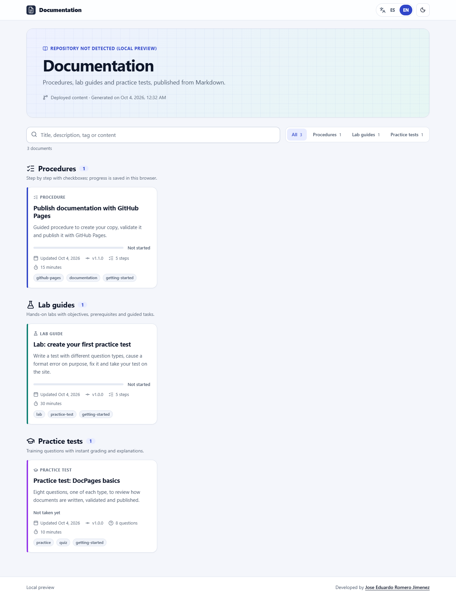
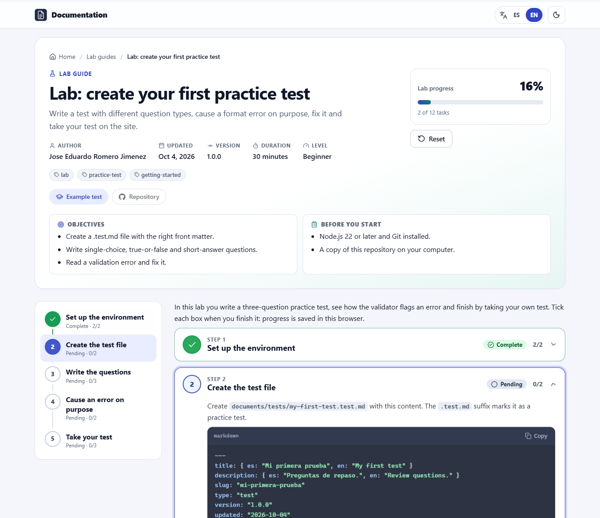
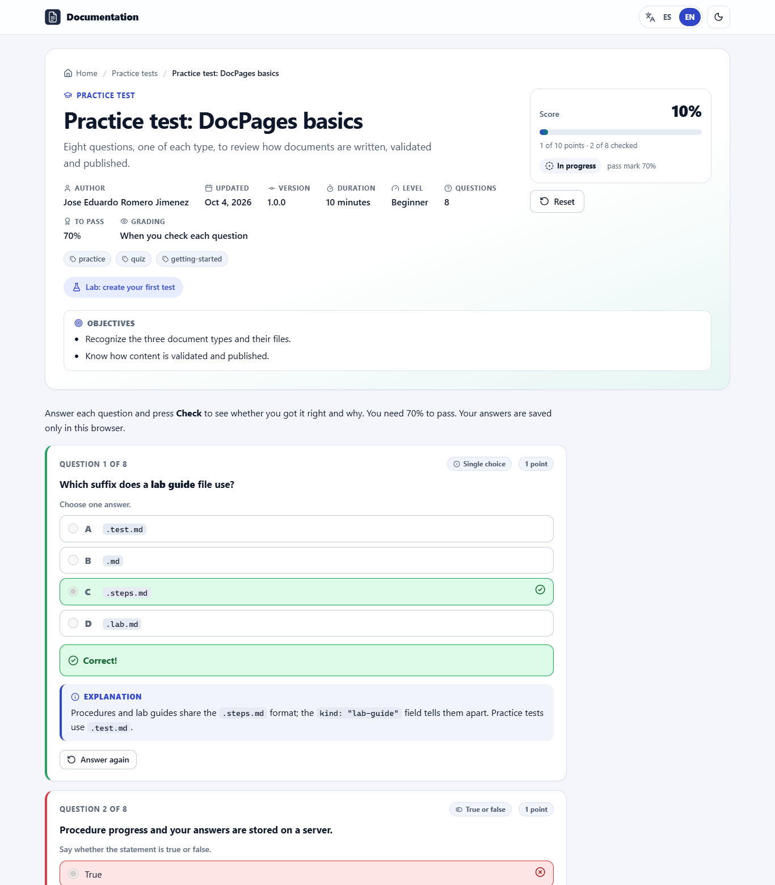

# DocPages

**Turn Markdown files into a bilingual (English/Spanish) website on GitHub Pages: step-by-step procedures, hands-on lab guides and practice tests.**

[Leer en español](README.es.md)

| Home | Lab guide | Practice test |
|---|---|---|
|  |  |  |

## What can I publish?

| Type | What the reader gets | File you write |
|---|---|---|
| **Procedure** | Steps with checkboxes and a progress bar. | `documents/steps/my-procedure.steps.md` |
| **Lab guide** | A procedure plus objectives, prerequisites, duration and level. | `documents/steps/my-lab.steps.md` with `kind: "lab-guide"` |
| **Practice test** | Training questions they answer, check and get a score for. | `documents/tests/my-test.test.md` |

Everything runs in the browser: no server, no database. Progress and answers are saved only in each reader's browser.

## Get started in 4 steps

1. Click **Use this template** (or fork the repository) to get your own copy.
2. In your copy, open **Settings → Pages** and set **Source** to **GitHub Actions**.
3. Add or edit files in `documents/` (see below) and push to `main`.
4. Wait for the green check in the **Actions** tab. Your site is at `https://<your-user>.github.io/<your-repo>/`.

You don't need to change any names or links: the site detects your user and repository by itself. The files already in `documents/` are examples; keep them, edit them or delete them.

## Write a procedure

Create `documents/steps/install-the-app.steps.md`:

```markdown
---
title: "Install the app"
description: "From download to first launch."
slug: "install-the-app"
type: "steps"
kind: "procedure"
version: "1.0.0"
updated: "2026-10-04"
---

:::step id="download" title="Download"
- [ ] Download the installer.
- [ ] Check the file size.
:::

:::step id="install" title="Install"
- [ ] Run the installer.
:::
```

- Everything between `:::step` and `:::` is one step. You can put `:::substep` blocks inside a step.
- Each `- [ ]` line is a checkbox that counts toward the progress bar.
- `id` must be unique inside the file. `slug` is the page address and must be unique across all files.

## Write a lab guide

It is a procedure with `kind: "lab-guide"` and a few extra fields that appear at the top of the page:

```markdown
---
title: "Lab: your first container"
description: "Run a container and stop it."
slug: "lab-first-container"
type: "steps"
kind: "lab-guide"
version: "1.0.0"
updated: "2026-10-04"
duration: "30 minutes"
level: "beginner"
objectives:
  - "Run a container."
  - "Stop it."
prerequisites:
  - "Docker installed."
---

:::step id="run" title="Run the container"
- [ ] `docker run hello-world` prints a greeting.
:::
```

`level` can be `beginner`, `intermediate` or `advanced`. Full example: [`first-practice-test-lab.steps.md`](documents/steps/first-practice-test-lab.steps.md).

## Write a practice test

Create `documents/tests/networking-basics.test.md`. Each question is a `:::question` block:

```markdown
---
title: "Networking basics"
description: "Quick review questions."
slug: "networking-basics"
type: "test"
version: "1.0.0"
updated: "2026-10-04"
passingScore: 70
---

:::question type="single"
Which port does HTTPS use?
- [ ] 80
- [x] 443
- [ ] 22
:::explanation
HTTPS uses port 443 by default.
:::
:::

:::question type="true-false" answer="false"
UDP guarantees that packets arrive.
:::
```

Mark the right option with `[x]`. `:::explanation` (optional) shows up after the reader checks the answer. `:::hint` (optional) is a hint the reader can open.

### Question types

| `type` | Use it for | How to give the answer |
|---|---|---|
| `single` | Pick one option | `- [ ]` options; mark exactly one with `- [x]` |
| `multiple` | Pick all that apply | Mark every correct option with `- [x]` |
| `true-false` | True or false | `answer="true"` or `answer="false"` |
| `text` | Short answer | `answer="DNS\|Domain Name System"` (alternatives separated by `\|`; case and accents don't matter) |
| `number` | Numeric answer | `answer="255"`, optionally `tolerance="0.5"` |
| `order` | Put items in order | A numbered list in the right order (the site shuffles it) |
| `match` | Match pairs | A list of `item :: match` lines |

```markdown
:::question type="match"
Match each protocol with its port:

- HTTP :: 80
- HTTPS :: 443
- SSH :: 22
:::
```

More options: `points="2"` on a question (default is 1). In the front matter, `feedback: "end"` grades everything when the reader finishes, and `shuffle: true` shuffles the options. Full example with all seven types: [`docpages-basics.test.md`](documents/tests/docpages-basics.test.md).

> [!NOTE]
> The answers live in your Markdown, which is public. Practice tests are for training, not for official exams.

## Two languages (optional)

Text you write once shows in both languages. To translate, use `{ es: "…", en: "…" }` in the front matter, `title.es="…" title.en="…"` on steps, and `:::lang` blocks in the body:

```markdown
:::lang en
Hello! This paragraph is shown in English.
:::
:::lang es
¡Hola! Este párrafo se muestra en español.
:::
```

The reader switches language with the ES/EN buttons at the top of the site.

## If a file is wrong, you'll know

The site never publishes a file that doesn't follow the format. Check your files with:

```bash
npm run validate
```

Each problem comes with the file, the line and the reason (the messages are in Spanish):

```text
✖ documents/tests/networking-basics.test.md
    error   L11: Pregunta 1: una pregunta «single» necesita exactamente una opción correcta «- [x]» (tiene 0).
```

On GitHub the same check runs on every push and pull request. If it fails, GitHub marks the line in the file and the published site stays as it was.

| The message says… | What to do |
|---|---|
| «El archivo no sigue el formato» | Rename the file so it ends in `.steps.md` or `.test.md`, or move it out of `documents/`. |
| «Atributo desconocido» or «Atributo mal escrito» | Fix the typo in the `:::` line and use quotes: `title="…"`. |
| «exactamente una opción correcta» | Mark exactly one `- [x]` (use `type="multiple"` for several). |
| «fuera de un «:::question»» | Move the options inside a question block. |
| «slug duplicado» | Two files use the same `slug`; change one. |

## Try it on your computer (optional)

You need [Node.js](https://nodejs.org/) 22 or later.

```bash
npm ci            # install (once)
npm run validate  # check your documents
npm run preview   # open http://localhost:8080/docpages/
```

## Settings

- **Show only some types:** in `assets/js/config.js`, set `DOCUMENTATION_MODE` to `"all"` (everything), `"steps"` (procedures and lab guides) or `"tests"` (practice tests).
- **Site name:** `siteTitle` and `siteTagline` in the same file.
- **Colors and logo:** the variables at the top of `assets/css/app.css` and the file `assets/icons/logo.svg`.

## Common problems

| Problem | Solution |
|---|---|
| The workflow fails at «Configurar GitHub Pages» | Settings → Pages → Source: **GitHub Actions**, then re-run the workflow. |
| My new document doesn't show up | Run `npm run validate`; check the file name and folder. |
| My progress or answers disappeared | You changed `version`, `slug` or an `id`. Each version keeps its own progress on purpose. |
| «Rate limit» when refreshing from GitHub | GitHub allows 60 requests per hour without login. Wait and try again. |
| Opening `index.html` directly shows an error | Use `npm run preview`: the documents can't be loaded from `file://`. |

## Using an AI assistant

The skill [`.github/skills/documentation-pages/SKILL.md`](.github/skills/documentation-pages/SKILL.md) teaches AI agents (GitHub Copilot, Claude…) every rule. For example, paste your questions and answers and ask: *"Turn these into a practice test"*. The agent writes a valid `.test.md` and runs `npm run validate`.

## For developers

<details>
<summary>Commands, how publishing works, structure and security</summary>

### Commands

| Command | What it does |
|---|---|
| `npm run vendor` | Copies the browser libraries to `assets/vendor/` and builds the icon sprite. |
| `npm run validate` | Validates every Markdown file in `documents/`. `--json` for agents, `--strict` to fail on warnings too. |
| `npm run manifest` | Writes `documents.manifest.json` (the site index). Writes nothing if there are errors. |
| `npm run check:links` | Checks internal links, images, imports and icons. |
| `npm test` | Unit, integration (jsdom) and accessibility (axe-core) tests. |
| `npm run build` | Everything above except the tests, plus the static site in `_site/`. |
| `npm run preview` | Builds and serves `_site/` under `/docpages/`, like a GitHub Pages project site. |

On Git Bash for Windows, prefix `MSYS_NO_PATHCONV=1` when running `node scripts/serve.mjs --base /my-repo/`.

### Publishing

- [`.github/workflows/pages.yml`](.github/workflows/pages.yml) runs on every push to `main`: install, validate, build the manifest with your repository data, check links, test, build `_site/` and deploy. Minimal permissions (`contents: read`, `pages: write`, `id-token: write`), actions pinned by SHA, no overlapping deployments.
- [`.github/workflows/validate.yml`](.github/workflows/validate.yml) runs on pull requests with read-only permissions, so errors are flagged before merging.
- Without Actions: run `npm run vendor && npm run manifest`, commit the result, set **Settings → Pages → Deploy from a branch → `main` / root**, and keep the `.nojekyll` file.

### How it works

- Hash routes (`#/steps/{slug}`, `#/tests/{slug}`), so the site works at the domain root and under `/{repository}/`.
- The repository is detected from the GitHub Pages URL, then from the deployment manifest; `CONFIG.repository` in `config.js` overrides both (useful with a custom domain).
- **Refresh from the public repository** reads the live documents through the public GitHub API, validates them with the same rules as CI and shows invalid files with their errors. If GitHub is unreachable, the deployed content is kept.
- The Node scripts import the same modules as the browser, so local, CI and live validation always agree.

### Structure

```text
assets/js/        app, router, Markdown parser, validation, steps.js (procedures and labs), quiz.js (practice tests)
assets/css/       styles (light/dark themes)
assets/vendor/    markdown-it, js-yaml, DOMPurify, Prism (no CDN)
documents/        your documents (steps/ and tests/)
schemas/          JSON Schema of the front matter
scripts/          validate, manifest, check-links, build-site, serve, vendor
tests/            node:test + jsdom + axe-core
docs/             progress flow diagram and screenshots
```

### Security

Raw HTML is never executed: markdown-it runs with `html: false` and all generated HTML goes through DOMPurify. Only `http(s)`, `mailto`, `tel`, anchors and relative links are allowed (`javascript:` and `data:` are validation errors). A strict Content Security Policy blocks inline scripts and styles. There are no tokens in the frontend; the public API is used without authentication (60 requests per hour per IP).

### Accessibility

Semantic HTML, keyboard navigation, visible focus, screen reader announcements, statuses shown with icon and text (not only color) and `prefers-reduced-motion` support. The tests run axe-core on every view in both languages.

</details>

## Credits

Developed by **Jose Eduardo Romero Jimenez** · [github.com/Edunzz](https://github.com/Edunzz).

License: [MIT](LICENSE) · Contributing: [CONTRIBUTING.md](CONTRIBUTING.md) (in Spanish) · Third-party libraries: [notices](assets/vendor/THIRD_PARTY_NOTICES.md).
