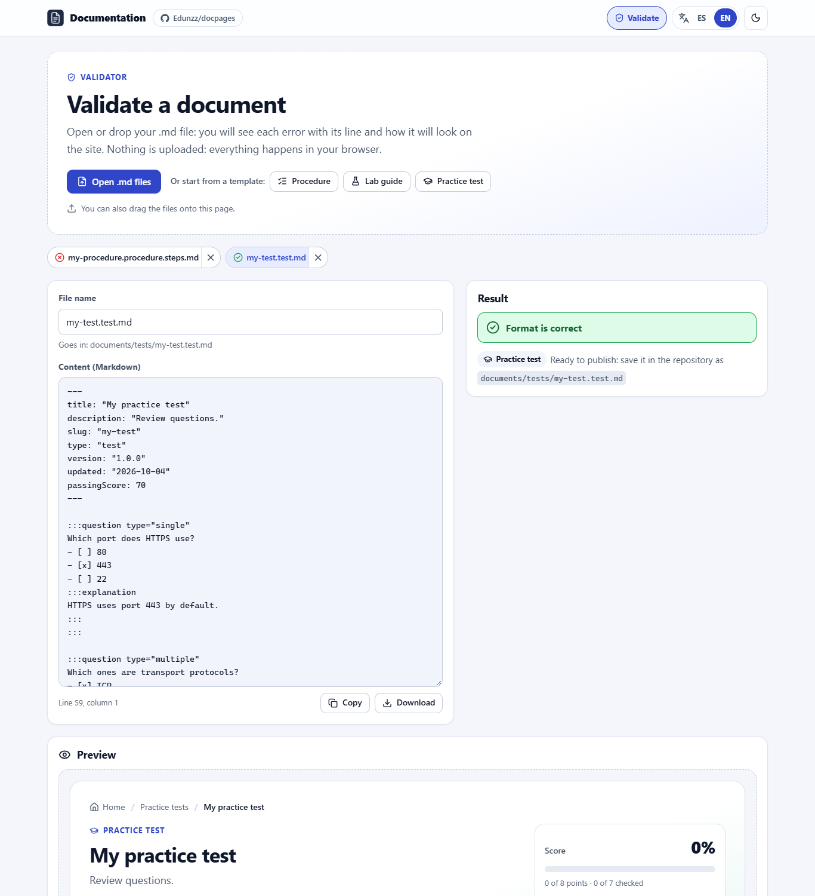

# DocPages

**Turn Markdown files into a bilingual (English/Spanish) website on GitHub Pages: step-by-step procedures, hands-on lab guides and practice tests. Nothing to install, nothing to build.**

[Leer en español](README.es.md)

| Home | Validate tab |
|---|---|
|  |  |
| **Lab guide** | **Practice test** |
|  |  |

## What can I publish?

| Type | What the reader gets | The file name ends in |
|---|---|---|
| **Procedure** | Steps with checkboxes and a progress bar. | `.procedure.steps.md` |
| **Lab guide** | A procedure plus objectives, prerequisites, duration and level. | `.labguide.steps.md` |
| **Practice test** | Training questions they answer, check and get a score for. | `.test.md` |

**The end of the file name decides the type.** Procedures and lab guides go in `documents/steps/`, practice tests in `documents/tests/`.

Everything runs in the browser: no server, no database, no build step. Progress and answers are saved only in each reader's browser.

## Get started in 3 steps

1. Click **Use this template** (or fork the repository) to get your own copy.
2. In your copy, open **Settings → Pages** and choose **Deploy from a branch**, branch **`main`**, folder **`/ (root)`**. Save.
3. Add or edit files in `documents/` and upload them to `main`. In a minute or two your site is at `https://<your-user>.github.io/<your-repo>/`.

You don't need to change any names or links: the site detects your user and repository by itself, and finds your documents by itself. The files already in `documents/` are examples; keep them, edit them or delete them.

## Write a procedure

Create `documents/steps/install-the-app.procedure.steps.md`:

```markdown
---
title: "Install the app"
description: "From download to first launch."
slug: "install-the-app"
type: "steps"
version: "1.0.0"
updated: "2026-10-04"
---

:::step id="download" title="Download"
- [ ] Download the installer.
- [ ] Check the file size.
:::

:::step id="install" title="Install"
- [ ] Run the installer.
:::
```

- Everything between `:::step` and `:::` is one step. You can put `:::substep` blocks inside a step.
- Each `- [ ]` line is a checkbox that counts toward the progress bar.
- `id` must be unique inside the file. `slug` is the page address and must be unique across all files.

## Write a lab guide

Same format, but the name ends in `.labguide.steps.md`, and you can add objectives, prerequisites, duration and level (they appear at the top of the page). Create `documents/steps/first-container.labguide.steps.md`:

```markdown
---
title: "Lab: your first container"
description: "Run a container and stop it."
slug: "lab-first-container"
type: "steps"
version: "1.0.0"
updated: "2026-10-04"
duration: "30 minutes"
level: "beginner"
objectives:
  - "Run a container."
  - "Stop it."
prerequisites:
  - "Docker installed."
---

:::step id="run" title="Run the container"
- [ ] `docker run hello-world` prints a greeting.
:::
```

`level` can be `beginner`, `intermediate` or `advanced`. Full example, which teaches the seven question types: [`first-practice-test-lab.labguide.steps.md`](documents/steps/first-practice-test-lab.labguide.steps.md).

## Write a practice test

Create `documents/tests/networking-basics.test.md`. Each question is a `:::question` block:

```markdown
---
title: "Networking basics"
description: "Quick review questions."
slug: "networking-basics"
type: "test"
version: "1.0.0"
updated: "2026-10-04"
passingScore: 70
---

:::question type="single"
Which port does HTTPS use?
- [ ] 80
- [x] 443
- [ ] 22
:::explanation
HTTPS uses port 443 by default.
:::
:::

:::question type="true-false" answer="false"
UDP guarantees that packets arrive.
:::
```

Mark the right option with `[x]`. `:::explanation` (optional) shows up after the reader checks the answer. `:::hint` (optional) is a hint the reader can open.

### Question types

| `type` | Use it for | How to give the answer |
|---|---|---|
| `single` | Pick one option | `- [ ]` options; mark exactly one with `- [x]` |
| `multiple` | Pick all that apply | Mark every correct option with `- [x]` |
| `true-false` | True or false | `answer="true"` or `answer="false"` |
| `text` | Short answer | `answer="DNS\|Domain Name System"` (alternatives separated by `\|`; case and accents don't matter) |
| `number` | Numeric answer | `answer="255"`, optionally `tolerance="0.5"` |
| `order` | Put items in order | A numbered list in the right order (the site shuffles it) |
| `match` | Match pairs | A list of `item :: match` lines |

```markdown
:::question type="match"
Match each protocol with its port:

- HTTP :: 80
- HTTPS :: 443
- SSH :: 22
:::
```

More options: `points="2"` on a question (default is 1). In the front matter, `feedback: "end"` grades everything when the reader finishes, and `shuffle: true` shuffles the options. Full example with all seven types: [`docpages-basics.test.md`](documents/tests/docpages-basics.test.md).

> [!NOTE]
> The answers live in your Markdown, which is public. Practice tests are for training, not for official exams.

## Two languages (optional)

Text you write once shows in both languages. To translate, use `{ es: "…", en: "…" }` in the front matter, `title.es="…" title.en="…"` on steps, and `:::lang` blocks in the body:

```markdown
:::lang en
Hello! This paragraph is shown in English.
:::
:::lang es
¡Hola! Este párrafo se muestra en español.
:::
```

The reader switches language with the ES/EN buttons at the top of the site.

## Check your document: the Validate tab

Open **Validate** (top right of the site, published or on your computer):

1. **Open** or drag your `.md` files, or start from a **template** (procedure, lab guide or practice test with the seven question types).
2. Each error shows **its line**; click it and the cursor jumps there. You can fix it right in the editor.
3. When there are no errors you see the **real preview**: you can tick steps or answer the questions.
4. **Download** the file (or copy it), save it in the folder shown and upload it to `main`.

Nothing is uploaded anywhere: everything happens in your browser. The validator also warns you if another document already uses your `slug`.

The site never publishes a file that doesn't follow the format: if one slips into `documents/`, the home page lists it under **Documents with format errors**, with the line of each error.

| The message says… | What to do |
|---|---|
| «El archivo no sigue el formato» / «Indica el tipo en el nombre» | Rename it so it ends in `.procedure.steps.md`, `.labguide.steps.md` or `.test.md`. |
| «Atributo desconocido» or «Atributo mal escrito» | Fix the typo in the `:::` line and use quotes: `title="…"`. |
| «exactamente una opción correcta» | Mark exactly one `- [x]` (use `type="multiple"` for several). |
| «fuera de un «:::question»» | Move the options inside a question block. |
| «slug duplicado» / «ya lo usa» | Two files use the same `slug`; change one. |

The validator messages are in Spanish; the rest of the site follows the selected language.

## See it on your computer (optional)

Serve the repository folder with any web server that lists folders. In VS Code, right-click `index.html` → **Open with Live Server**; or, in a terminal inside the folder:

```bash
python -m http.server 8000
```

Open <http://localhost:8000/>. The home page shows what is in **your** `documents/` folder, with errors flagged, and the repository links point to your copy. Double-clicking `index.html` does not work: browsers block the app when it is opened as a file.

## Settings

- **Show only some types:** in `assets/js/config.js`, set `DOCUMENTATION_MODE` to `"all"` (everything), `"steps"` (procedures and lab guides) or `"tests"` (practice tests).
- **Site name:** `siteTitle` and `siteTagline` in the same file.
- **Custom domain:** set `repository: { owner: "you", name: "your-repo" }` in the same file, so the site knows which repository to read.
- **Colors and logo:** the variables at the top of `assets/css/app.css` and the file `assets/icons/logo.svg`.

## Common problems

| Problem | Solution |
|---|---|
| A new document doesn't show up | Wait a minute or two for Pages and press **Refresh** on the home page. Check the name in **Validate**. |
| «Rate limit» on the home page | The site reads the document list from GitHub (at most once every 10 minutes per browser), and GitHub allows 60 reads per hour per network. Wait a bit; meanwhile the last saved list is used. |
| My progress or answers disappeared | You changed `version`, `slug` or an `id`. Each version keeps its own progress on purpose. |
| The site shows Markdown as plain pages | The `.nojekyll` file is missing from the root; add it back (an empty file). |

## Using an AI assistant

The skill [`.github/skills/documentation-pages/SKILL.md`](.github/skills/documentation-pages/SKILL.md) teaches AI agents (GitHub Copilot, Claude…) every rule. For example, paste your questions and answers and ask: *"Turn these into a practice test"*. The agent writes a valid `.test.md`; you check it in **Validate** and upload it.

## For developers

<details>
<summary>How it works, tests, structure and security</summary>

### How it works

- **No build step.** GitHub Pages serves the repository as is. The browser libraries are committed in `assets/vendor/` (no CDN).
- **Document list.** On GitHub Pages, one call to the public GitHub API (`git/trees/HEAD`) lists `documents/`, cached for 10 minutes per browser; if it fails, the last saved list is used. Locally, the site reads the folder listing of the web server.
- **Repository.** From the GitHub Pages URL; locally from `.git/config` (`origin`) if the server serves it; `CONFIG.repository` overrides both.
- **Same rules everywhere.** The home page, the Validate tab and the command-line validator use the same modules (`assets/js/documents.js`, `quiz.js`, `markdown.js`, `schema.js`).
- Hash routes (`#/steps/{slug}`, `#/tests/{slug}`, `#/validate`), so the site works at the domain root and under `/{repository}/`.

### Command line (optional)

```bash
node scripts/validate-documents.mjs        # needs only Node: --json for agents, --strict to fail on warnings
npm ci && npm test                         # unit, integration (jsdom) and accessibility (axe-core) tests
npm run check:links                        # internal links, imports and icons
npm run vendor                             # refresh assets/vendor and the icon sprite after updating libraries
```

On GitHub Actions, `validate-documents.mjs` also prints `::error file=…,line=…::` annotations, if you want to add your own check.

### Structure

```text
assets/js/        app, router, catalog (document discovery), validator (Validate tab), steps, quiz, parser, validation
assets/css/       styles (light/dark themes, responsive)
assets/vendor/    markdown-it, js-yaml, DOMPurify, Prism
documents/        your documents (steps/ and tests/)
schemas/          JSON Schema of the front matter
scripts/          validate-documents, check-links, vendor
tests/            node:test + jsdom + axe-core
docs/             progress flow diagram and screenshots
```

### Security

Raw HTML is never executed: markdown-it runs with `html: false` and all generated HTML goes through DOMPurify. Only `http(s)`, `mailto`, `tel`, anchors and relative links are allowed (`javascript:` and `data:` are validation errors). A strict Content Security Policy blocks inline scripts and styles. There are no tokens in the frontend. The Validate tab never uploads files.

### Accessibility

Semantic HTML, keyboard navigation, visible focus, screen reader announcements, statuses shown with icon and text (not only color), `prefers-reduced-motion` support and a layout that works from 360 px phones to wide screens. The tests run axe-core on every view in both languages.

</details>

## Credits

Developed by **Jose Eduardo Romero Jimenez** · [github.com/Edunzz](https://github.com/Edunzz).

License: [MIT](LICENSE) · Contributing: [CONTRIBUTING.md](CONTRIBUTING.md) (in Spanish) · Third-party libraries: [notices](assets/vendor/THIRD_PARTY_NOTICES.md).
